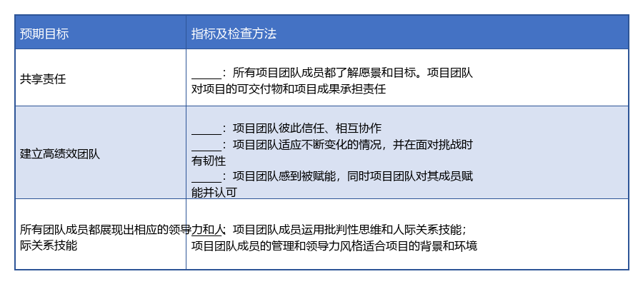

# 考点1：资源管理

## 试题 1

A 公司为了争取成为某企业的长期供应商，成本价承接了其内网文件共享平台的开发项目，并指定由小王任项目经理。

小王考虑到小王之前没有同类项目经验，希望能抽调精兵强将组建项目团队。A 公司各个部门的经理都不愿意出借业务骨干，产品总监也表示没有产品经理可以投入。多方协调下小王才从研发团队要到了 3 名开发人员兼职参与项目，负责产品和研发相关工作。

项目开始后，在需要处理产品类问题时，双方之间互相推诿，都表示对文件共享平台业务不熟悉，不会处理产品类问题，此时小王紧急制定了人员招聘计划。项目需要使用服务器进行软件编译，但服务器一直被其他项目占用。团队成员都在抱怨手头已经有几个项目，现在干的工作都是在自己的 KPI 外，额外增加了自己的工作量。

小王觉得，这样下去工作很难顺利开展，项目很有可能无法按时交付。

---

**【问题 1】（10 分）**

结合案例，请指出此项目资源管理中存在的问题。

---

**【问题 2】（5 分）**

请简要描述在项目进行期间可以通过哪些工具和技术来建设项目团队。

---

**【问题 3】（5 分）**

结合案例，判断下列描述的正误（正确的选"√"，错误的选"×"）。

（1）项目管理的责任必须由项目经理来承担。（  ）

（2）生命周期中，项目相关人的数量、类型和特点都保持稳定不变。（  ）

（3）责任分配矩阵反映了团队成员个人与其承担的工作之间的联系。（  ）

（4）虚拟团队是近些年来常用的团队组织方式，比集中办公更好。（  ）

（5）在项目的管理环境里，冲突是不可避免的。（  ）

---

**【问题 4】**

